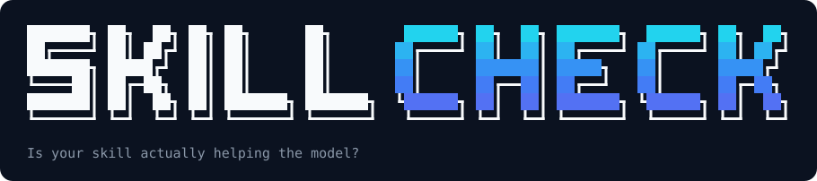
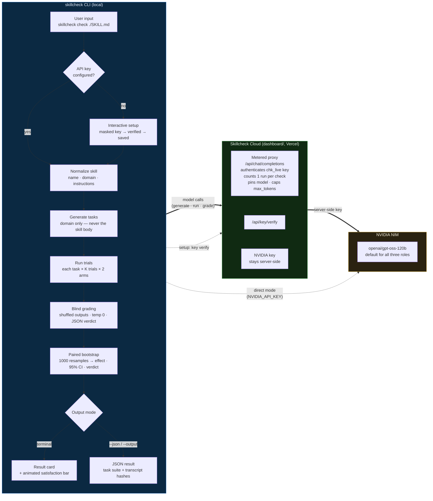

<div align="center">
  
</div>

<p align="center">
  <a href="https://www.npmjs.com/package/@sx4im/skillcheck"></a>
  <a href="https://www.npmjs.com/package/@sx4im/skillcheck"></a>
  <a href="https://github.com/sx4im/skillcheck/actions"></a>
  <a href="LICENSE"></a>
  <a href="https://nodejs.org"></a>
</p>

**Measure whether an agent skill actually improves a model's task performance.**

Most published `SKILL.md` files have never been tested. You can't tell whether they
help your model or are just decoration. Skillcheck answers that with a controlled
experiment instead of a vibe check.

Point it at any Markdown skill file and it runs an A/B test: it generates fresh tasks
for the skill's declared domain, has the model solve every task **with** and
**without** the skill injected, grades both arms **blind**, and reports the measured
effect with a bootstrap confidence interval and a 0–100 quality score.

```
$ skillcheck

✓ Evaluation tasks ready · 12s
✓ Trials complete (30/30) · 1m 38s
✓ Grading complete (30/30) · 41s
✓ Analysis complete · 2m 33s

╭────────────────────────────────────────────────────────╮
│ SKILLCHECK RESULT                                      │
├────────────────────────────────────────────────────────┤
│ Skill         API Documentation                        │
│ Run size      5 tasks × 3 trials                       │
│                                                        │
│ Verdict       HELPS                                    │
│ The skill HELPED — model passed 80% of tasks with it   │
│ vs 55% without.                                        │
│                                                        │
│ With skill    80.0% of tasks passed                    │
│ Without skill 55.0% of tasks passed                    │
│ Skill effect  +25.0 pp change in pass rate             │
│ Confidence    +8.0 pp to +42.0 pp (95% range)          │
│ Token cost    +480 tokens to include the skill         │
├────────────────────────────────────────────────────────┤
│ Satisfaction  ██████████████░░░░  75.0/100  GOOD       │
╰────────────────────────────────────────────────────────╯
```

## Table of contents

- [Install](#install)
- [Quick start](#quick-start)
- [How it works](#how-it-works)
- [Architecture](#architecture)
- [Commands](#commands)
- [Reading the result](#reading-the-result)
- [Effort levels](#effort-levels)
- [Terminal experience](#terminal-experience)
- [Configuration](#configuration)
- [Model choice](#model-choice)
- [Self-hosting](#self-hosting)
- [Development](#development)
- [Star history](#star-history)
- [License](#license)

## Install

```bash
npm install -g @sx4im/skillcheck

# or run it without installing:
npx @sx4im/skillcheck
```

Requires **Node.js 20+**. Works on Linux, macOS, and Windows.

Skillcheck checks npm for a newer version about once a day and offers to update
(like the Codex and Gemini CLIs). Disable with `SKILLCHECK_NO_UPDATE_CHECK=1`.

## Quick start

```bash
skillcheck
```

On first run it asks for your Skillcheck API key (grab a free one from the dashboard —
the URL is built in, and the free tier includes 10 checks). Key entry is masked, the
key is verified before it's saved, then a full-screen file picker opens: navigate
folders with the arrow keys, pick any `.md` file, choose an effort level from the
arrow-key menu, and watch the live progress tracker until the result card lands.
The picker runs on the terminal's alternate screen, so quitting hands your
scrollback right back.

Point it straight at a file or folder to skip the picker:

```bash
skillcheck check ./SKILL.md
skillcheck ./my-skill-folder            # a folder containing a .md
skillcheck check ./SKILL.md --json      # machine-readable output
skillcheck check ./SKILL.md --output result.json
```

Fully headless (CI, scripts) — set the key via environment variable:

```bash
export SKILLCHECK_TOKEN=chk_live_...
skillcheck check ./SKILL.md --tasks 5 --trials 3 --json
```

## How it works

Skillcheck treats a skill like a drug trial treats a drug:

1. **Normalize** — the skill file is parsed; its *declared domain* is read from
   front matter (`domain:`/`description:`) or the first heading.
2. **Generate** — a task generator sees **only the domain, never the skill body**,
   so the tasks can't leak the skill's instructions. It produces 2× candidate
   tasks; a seeded shuffle picks the final set.
3. **Run** — every task runs `K` trials in two arms: *with* the skill injected as
   a system prompt, and *without* it. Same model, same temperature.
4. **Grade** — a **blind** grader scores each output against the task's pass/fail
   criterion. It never knows which arm produced the output (outputs are shuffled),
   and grades at temperature 0 in JSON mode.
5. **Score** — pass rates are compared pairwise and a 1000-iteration paired
   bootstrap produces the effect size, a 95% confidence interval, and the verdict:
   `HELPS` (CI fully above zero), `HARMS` (fully below), or `PLACEBO` (overlaps zero).

Every run is fresh: tasks and outputs are generated anew each time and `check`
stores nothing locally, so a repeated check is an independent measurement. Full
methodology in [`METHODOLOGY.md`](METHODOLOGY.md).

## Architecture

How a check flows from your terminal to the result card:



Key properties:

- **One metered run per check** — every model call in a check shares a run id, so
  the hosted proxy counts the whole check as a single run.
- **No provider key on your machine** (hosted mode) — the CLI talks to the proxy;
  the NVIDIA key lives only on the server.
- **Direct mode** — set `NVIDIA_API_KEY` to bypass the proxy entirely and call
  NVIDIA NIM with your own key.

## Commands

```bash
skillcheck                                  # interactive: pick a file, pick effort, run
skillcheck check <path> [--tasks N] [--trials K] [--output file.json] [--json]
skillcheck setup                            # connect / change your API key
skillcheck logout                           # remove your saved API key
skillcheck eval <path> [--tasks N] [--trials K] [--output file.json]   # raw JSON evaluator
skillcheck verify <result.json> [--sample n]  # independently re-measure a published result
skillcheck corpus run --corpus corpus.json [--results dir]             # batch-evaluate many skills
skillcheck rot [--results dir] [--output report.json]                  # detect skills that stopped helping
skillcheck --version
```

Accepted inputs: any Markdown (`.md`) file — `SKILL.md`, `AGENTS.md`, `CLAUDE.md`,
or any other `.md` — or a folder containing one. `--tasks` is capped at 50 and
`--trials` at 10; mistyped options are rejected rather than silently ignored.

## Reading the result

- **Verdict** — `HELPS` / `PLACEBO` / `HARMS`, decided by whether the 95%
  confidence interval clears zero. `PLACEBO` means *no measurable difference*,
  not necessarily a bad skill.
- **Skill effect** — the change in pass rate, in percentage points (pp).
- **Confidence** — the 95% range for the true effect. A **wide** range means the
  run was inconclusive; re-run at a higher effort for a clearer signal.
- **Token cost** — the prompt-token overhead of including the skill.
- **Satisfaction** — a 0–100 quality score where **50 = no effect**:

  | Score | Band | Score | Band |
  |-------|------|-------|------|
  | ≤10 | Very bad | 51–60 | Decent |
  | 11–30 | Bad | 61–80 | Good |
  | 31–50 | Normal | 81–100 | Excellent |

Each run is an independent experiment — tasks and model outputs are generated
fresh every time, so results vary run to run. That variance is what the
confidence interval quantifies.

## Effort levels

The interactive run asks how thorough to be — more tasks/trials means a tighter
confidence interval but a longer run:

| Level    | Tasks × trials | Typical time |
|----------|----------------|--------------|
| Quick    | 2 × 1          | ~30 sec      |
| Standard | 3 × 2          | ~1–2 min     |
| Thorough | 5 × 3          | ~3–4 min     |

For scripted runs, set it explicitly: `skillcheck check ./SKILL.md --tasks 5 --trials 3`.

## Terminal experience

The CLI is built to feel like a first-class developer tool:

- **Live step tracker** — each phase persists as a receipt line
  (`✓ Trials complete (30/30) · 1m 38s`) while the active phase shows a spinner,
  a progress bar, and elapsed time. Progress renders on **stderr**, so piping
  stdout still gives you a clean result; piped stderr gets plain log lines
  instead of spinner frames.
- **Animated result card** — the satisfaction bar sweeps to its score on
  interactive terminals; non-TTY output is the same card, static.
- **Adaptive colour** — truecolor gradients where supported, 256/16-colour
  fallbacks elsewhere. [`NO_COLOR`](https://no-color.org) (any non-empty value)
  disables colour entirely; `FORCE_COLOR=1|2|3` forces it on for piped output.
- **Quiet cancellation** — backing out of a menu with `q`/`Ctrl+C` exits with
  code `130` and a one-line note, not an error dump. Run failures print a
  concise `✗` block on stderr.
- **Masked secrets** — API-key entry never echoes; keys are stored at
  `~/.config/skillcheck/config.json` with `0600` permissions.

## Configuration

Credential precedence (highest wins):

| Setting | Mode | Effect |
|---|---|---|
| `NVIDIA_API_KEY` | direct | Call NVIDIA NIM with your own key, bypassing the proxy |
| `SKILLCHECK_TOKEN` | hosted | Use a Skillcheck Cloud key without saving anything |
| `skillcheck setup` | hosted | Verifies and saves your key to `~/.config/skillcheck/config.json` |

Optional environment variables:

| Variable | Default | Purpose |
|---|---|---|
| `SKILLCHECK_API_URL` | hosted cloud URL | Point at a self-hosted proxy deployment |
| `SKILLCHECK_MODEL` | `openai/gpt-oss-120b` | Override the model for all three roles |
| `NVIDIA_GENERATOR_MODEL` / `NVIDIA_RUNNER_MODEL` / `NVIDIA_GRADER_MODEL` | — | Per-role model overrides (direct mode) |
| `NVIDIA_BASE_URL` | `https://integrate.api.nvidia.com/v1` | Direct-mode endpoint |
| `NVIDIA_TIMEOUT_MS` | `120000` | Per-request timeout |
| `NVIDIA_REQUEST_DELAY_MS` | `750` | Minimum delay between requests (rate-limit safety) |
| `NVIDIA_MAX_ATTEMPTS` | `8` | Retry budget for retryable failures (429/5xx) |
| `NVIDIA_MAX_RETRY_DELAY_MS` | `60000` | Backoff cap |
| `SKILLCHECK_NO_UPDATE_CHECK` | — | `1` disables the daily update check |
| `SKILLCHECK_DEBUG` | — | `1` enables verbose per-call logging |
| `NO_COLOR` | — | Any non-empty value disables colour ([spec](https://no-color.org)) |
| `FORCE_COLOR` | — | `1`/`2`/`3` forces colour on, even when piped |

## Model choice

All three roles (task generator, runner, blind grader) default to
**`openai/gpt-oss-120b`**, selected by live benchmarking of the NIM catalog
(MiniMax M2.7, DeepSeek V4 Flash, Qwen3-Next/3.5, Llama 3.3 70B, Nemotron Nano):

- **It's the only large model in the fast lane.** A Standard check makes ~25
  sequential model calls; a Thorough check ~60, so per-call latency dominates UX.
  gpt-oss-120b answers in ~1–5 s on NIM. The other large models (MiniMax M2.7,
  DeepSeek V4, Qwen3-Next, Llama 3.3) queue for 60–110+ seconds *per call* on the
  shared endpoint — a single check would take hours.
- **Grading and generation need capability.** The verdict is only as good as the
  blind grader's judgment and the generator's task quality. The 120B model grades
  and generates noticeably more reliably than the sub-second
  `nvidia/nemotron-3-nano` alternative, which under-delivers task batches often
  enough that the CLI needs its retry path.
- **JSON mode must be dependable.** Generator and grader run with
  `response_format: json_object`; gpt-oss-120b returns clean JSON consistently
  (its built-in reasoning stays in `reasoning_content`, never the answer). Qwen
  3.5's NIM endpoint rejects `response_format` outright, ruling it out.

Prefer raw speed over judgment quality? Pin the nano model:
`SKILLCHECK_MODEL=nvidia/nemotron-3-nano-omni-30b-a3b-reasoning`. And you can
measure *your* production model in direct mode —
`NVIDIA_RUNNER_MODEL=<model> skillcheck eval ./SKILL.md` keeps the capable
grader while running trials on the model you actually ship with.

## Self-hosting

Skillcheck's hosted tier runs behind a metered proxy so end users never need a
provider key. The [`dashboard/`](dashboard/) folder is a deployable Vercel app
(Clerk sign-in, free-tier metering, optional Stripe upgrade) that issues
`chk_live_…` keys and forwards completions to your server-side NVIDIA key. See
[`dashboard/SETUP.md`](dashboard/SETUP.md) for the walkthrough.

To skip the proxy entirely, set `NVIDIA_API_KEY` (see
[`.env.example`](.env.example)).

## Development

```bash
npm ci
npm run build      # compile to dist/
npm test           # vitest (73 tests)
npm run typecheck  # strict TS, src + tests
```

The CLI lives in [`packages/cli`](packages/cli) (`bin/skillcheck.ts` → `src/cli.ts`).
`packages/site` is the static leaderboard site; `dashboard/` is the hosted cloud.
A scheduled [rot workflow](.github/workflows/rot.yml) re-runs the corpus weekly and
opens a PR when a skill's verdict regresses.

## Star history

If Skillcheck saved you from shipping a placebo skill, a ⭐ helps other people find it.

<a href="https://www.star-history.com/#sx4im/skillcheck&Date">
  <picture>
    <source media="(prefers-color-scheme: dark)" srcset="https://api.star-history.com/svg?repos=sx4im/skillcheck&type=Date&theme=dark" />
    <source media="(prefers-color-scheme: light)" srcset="https://api.star-history.com/svg?repos=sx4im/skillcheck&type=Date" />
    
  </picture>
</a>

## License

[MIT](LICENSE)
